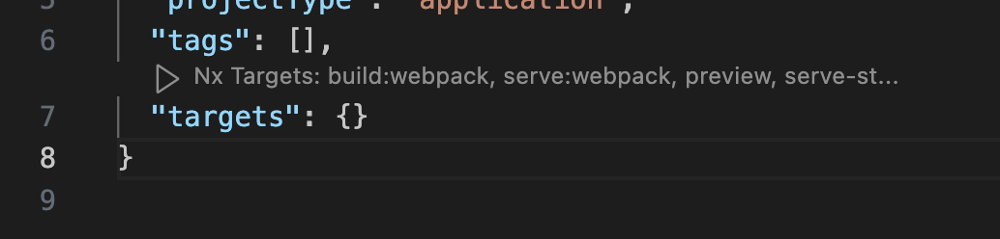
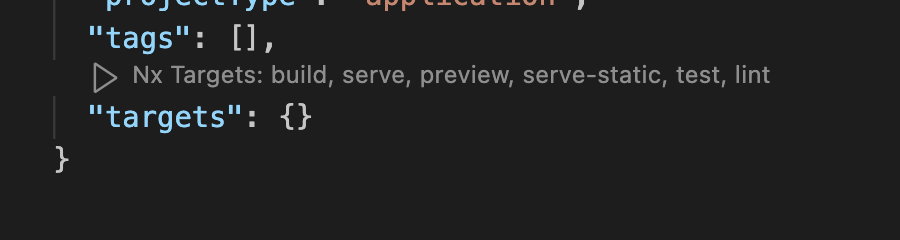

# Plan to make this into a monorepo with Nx support

Folder structure

```text
apps/
  contracts/
    src/
      assets/
      environments/
      main.ts
    jest.config.js
    tsconfig.app.json
    tsconfig.spec.json
    tsconfig.json
  guess-game/
  hero-game/
libs/
tools/
workspace.json
nx.json
package.json
tsconfig.json
```

## Notes

See the config in ethereum app

```json
"targets": {
    "compile": {
      // alternatively, we can write our own executor: https://nx.dev/extending-nx/recipes/local-executors
      "executor": "nx:run-script", // https://nx.dev/nx-api/nx/executors/run-script
      ""

    }
```

When we have plugins, nx somehow infers the target. It makes it easy if you install Nx Vs code plugin.

Vanilla JS app project somehow knows which build command to use. Not sure how they are inferring this...



The same goes for react project. It's not the presence of vite.conig.ts.



Not that you can only see these target through plug in once you restart VS code after creating these projects manually.

```json
 "plugins": [
    {
      "plugin": "@nx/vite/plugin",
      "options": {
        "buildTargetName": "build",
        "testTargetName": "test",
        "serveTargetName": "serve",
        "previewTargetName": "preview",
        "serveStaticTargetName": "serve-static"
      }
    },
    {
      "plugin": "@nx/webpack/plugin",
      "options": {
        "buildTargetName": "build:webpack",
        "serveTargetName": "serve:webpack"
      }
    },
    {
      "plugin": "@nx/eslint/plugin",
      "options": {
        "targetName": "lint"
      }
    },
    {
      "plugin": "@nx/cypress/plugin",
      "options": {
        "targetName": "e2e",
        "openTargetName": "open-cypress",
        "componentTestingTargetName": "component-test",
        "ciTargetName": "e2e-ci"
      }
    }
```
